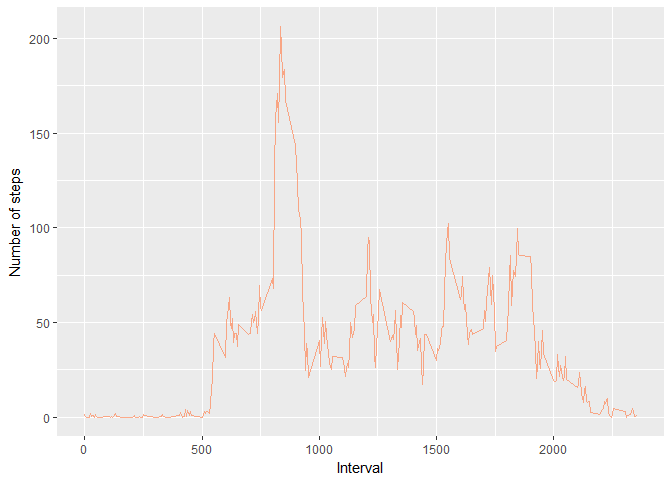
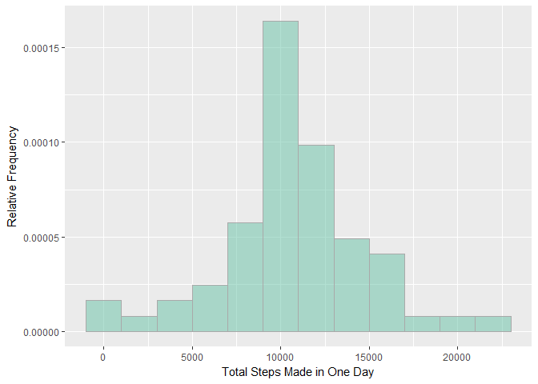
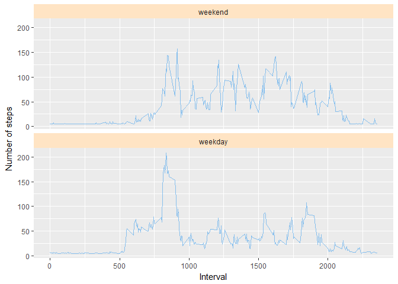

# Reproducible Research: Peer Assessment 1
>

## Loading and preprocessing the data

>
#### ***Loading of the desired R packages needed for the analysis***

> The following packages were loaded into R:


```r
library(dplyr)
```

```
## 
## Attaching package: 'dplyr'
```

```
## The following objects are masked from 'package:stats':
## 
##     filter, lag
```

```
## The following objects are masked from 'package:base':
## 
##     intersect, setdiff, setequal, union
```

```r
library(ggplot2)
library(RColorBrewer)
library(stringr)
library(lubridate)
```

```
## 
## Attaching package: 'lubridate'
```

```
## The following object is masked from 'package:base':
## 
##     date
```

> The dataset was downloaded from the website as a csv file into the R working directory, and saved with the filename, "**activity**".  Then the csv file was imported into R by the read.csv() function with stringsAsFactors=FALSE, into an object (a data frame), named "**activity**"


```r
activity <- read.csv("activity.csv", stringsAsFactors=FALSE)
```


> The structure of the "**activity**" data frame was assessed by str().  T


```r
str(activity  )
```

```
## 'data.frame':	17568 obs. of  3 variables:
##  $ steps   : int  NA NA NA NA NA NA NA NA NA NA ...
##  $ date    : chr  "2012-10-01" "2012-10-01" "2012-10-01" "2012-10-01" ...
##  $ interval: int  0 5 10 15 20 25 30 35 40 45 ...
```


> The NA's in the **activity** data frame was assessed in order to get an idea of what transformations will be done


```r
NAs <- activity %>% summarise(
				NA.steps = sum(is.na(steps)) , 
				NA.date= sum(is.na(date)), 
				NA.interval= sum(is.na(interval)))
NAs
```

```
##   NA.steps NA.date NA.interval
## 1     2304       0           0
```

> The variable *steps* was the only variable with NA's, while *interval* and *date* were complete caes
>

## What is mean total number of steps taken per day?
>

#### ***Make a histogram of the total number of steps taken each day***

> The data for plotting the histogram (the total steps made in one day) was made using the dplyr package.  Then the histograme of total steps taken each day as constructed using ggplot2 package.


```r
# data preparation
TotalStepsDay  <-activity %>% group_by(date) %>% summarise(total = sum(steps, na.rm=TRUE)) %>% ungroup(.) 

# histogram plotting
histogram_1 <- ggplot(data=TotalStepsDay, aes(x = total)) + 
		geom_histogram(aes(y=..density..), binwidth = 2000, 
		               col= "dark gray" , fill=brewer.pal(4, "Set2")[2], alpha=0.5)  +
    labs(x="Total Steps Made in One Day", y="Relative Frequency")
histogram_1
```

<!-- -->


> **NOTE 1**:  In the above histogram, the ***relative frequency***, instead of the count (or *absolute frequency*) for easier comparison with the other histogram (histogram 2 below). 

> **NOTE 2**:  The ***binwidth*** was selected to 2000, in order to produce a smooth histogram with no gaps.


## What is the average daily activity pattern?


#### ***Calculate and report the mean and median total number of steps taken per day***

> The dplyr package was used to obtain the total numer of steps per day:


```r
meanActivitySteps <- activity %>% group_by(date) %>% summarise(meanSteps = mean(steps, na.rm=TRUE)) %>% 
                    filter(!is.na(meanSteps)) %>% ungroup(.)
head(meanActivitySteps, 3)
```

```
## # A tibble: 3 x 2
##         date meanSteps
##        <chr>     <dbl>
## 1 2012-10-02   0.43750
## 2 2012-10-03  39.41667
## 3 2012-10-04  42.06944
```


```r
medianSActivitySteps<- activity %>% group_by(date) %>% 	summarise(medianSteps = median(steps, na.rm=TRUE)) %>%
			                filter(!is.na(medianSteps)) %>% ungroup(.) 
head(medianSActivitySteps, 3)
```

```
## # A tibble: 3 x 2
##         date medianSteps
##        <chr>       <dbl>
## 1 2012-10-02           0
## 2 2012-10-03           0
## 3 2012-10-04           0
```


```r
TotalSteps <- activity %>% group_by(date) %>% summarise(total_steps = sum(steps, na.rm=TRUE)) %>% ungroup(.)

head(data.frame(TotalSteps, 3))
```

```
##         date total_steps X3
## 1 2012-10-01           0  3
## 2 2012-10-02         126  3
## 3 2012-10-03       11352  3
## 4 2012-10-04       12116  3
## 5 2012-10-05       13294  3
## 6 2012-10-06       15420  3
```


```r
Overall_MeanMedianTOTAL <- TotalSteps %>% summarise(Overall_mean = mean(total_steps), Overall_median = median(total_steps))

Overall_MeanMedianTOTAL
```

```
## # A tibble: 1 x 2
##   Overall_mean Overall_median
##          <dbl>          <int>
## 1      9354.23          10395
```


#### ***Make a time series plot (i.e. type = "l") of the 5-minute interval (x-axis) and the average number of steps taken, averaged across all days (y-axis)*** 


>  First, a subset of the data frame, "**activity**" (missing values discarded).  The data frame was grouped by interval and a new column (mean_steps) was made to get the mean of steps each interval.  Then using this data frame wih NA's removed, the line_plot_1 was made.


```r
# The "active" dataa frame was manipulated to obtain the mean steps for each "group-by" interval.  Then the plot was made.

meanStep_byInterval_1 <- activity %>% filter(!is.na(steps)) %>% group_by(interval) %>% 
                        mutate(mean_steps=mean(steps, na.rm=TRUE)) %>% ungroup(.)
			
line_plot_1 <- ggplot(meanStep_byInterval_1 , aes(x=interval, y=mean_steps)) + geom_line(col=brewer.pal(4, "Set2")[2],alpha=0.75)+ 	            xlab ("Interval") + ylab("Number of steps") 
line_plot_1
```

<!-- -->

>

#### ***Which 5-minute interval, on average across all the days in the dataset, contains the maximum number of steps?***

> This was done by subsetting the complete_cases_activity data frame, for the interval that gave the maximum number of steps.


```r
max.index <- meanStep_byInterval_1$mean_steps==max(meanStep_byInterval_1$mean_steps)

interval_max_steps  <-
		unique(meanStep_byInterval_1[max.index, ]$interval)

# interval_max_steps

maximum_values <- data.frame(max.mean_seps=max(meanStep_byInterval_1$mean_steps), max_interval=interval_max_steps)
maximum_values
```

```
##   max.mean_seps max_interval
## 1      206.1698          835
```


## Imputing missing values


#### ***Calculate and report the total number of missing values in the dataset (i.e. the total number of rows with NAs) ***
 
>  This code for obtaining the NAs in the activity data frame (called **NAs** was already done previously, this will just be called again here.


```r
NAs
```

```
##   NA.steps NA.date NA.interval
## 1     2304       0           0
```

#### ***Devise a strategy for filling in all of the missing values in the dataset. The strategy does not need to be sophisticated. For example, you could use the mean/median for that day, or the mean for that 5-minute interval, etc***

> The **mean** of the steps per day was used as the "fill variable" for the NA's.  The dplyr package was used to impute the NA's in the *steps* variable in the **activity** data frame.  The resulting data frame with imputed NA's was called "***df_new ***"


```r
df_new <- activity %>%  group_by(date) 
df_new <- df_new  %>%
	mutate(
		steps = ifelse(is.na(steps), mean(df_new$steps, na.rm=TRUE), steps)
	) 
```

> In order to verify that all NA's were imputed, the NA's were counted for ***df_new***


```r
NAs_2 <-ungroup(df_new) %>% summarise(
				NA.steps = sum(is.na(steps)) , 
				NA.date= sum(is.na(date)), 
				NA.interval= sum(is.na(interval)))
NAs_2
```

```
## # A tibble: 1 x 3
##   NA.steps NA.date NA.interval
##      <int>   <int>       <int>
## 1        0       0           0
```

> All NA's were confirmed imputted with the target fill value, the median of steps for each day.  This was confirmed by the zero NA's for the steps variable.


#### ***Create a new dataset that is equal to the original dataset but with the missing data filled in***

> The new data frame (with imputted NA's) was obtained from the code *above*.  The resulting data frame was called ***df_new***


```r
str(data.frame(df_new))
```

```
## 'data.frame':	17568 obs. of  3 variables:
##  $ steps   : num  37.4 37.4 37.4 37.4 37.4 ...
##  $ date    : chr  "2012-10-01" "2012-10-01" "2012-10-01" "2012-10-01" ...
##  $ interval: int  0 5 10 15 20 25 30 35 40 45 ...
```

```r
head(data.frame(df_new), 3)
```

```
##     steps       date interval
## 1 37.3826 2012-10-01        0
## 2 37.3826 2012-10-01        5
## 3 37.3826 2012-10-01       10
```


#### ***Make a histogram of the total number of steps taken each day and Calculate and report the mean and median total number of steps taken per day***

#### ***Do these values differ from the estimates from the first part of the assignment? What is the impact of imputing missing data on the estimates of the total daily number of steps? ***

> The new data frame (with imputed missing values) was manipulated by the dplyr package to get the total steps per day.  The resulting data frame was named, **df_newTOTAL**.

> Then the corresponding histogram was plotted, as shown.


```r
# Draw histogram 2

df_newTOTAL <- df_new %>% summarise(total = sum(steps)) 

histogram_2 <- ggplot(data=df_newTOTAL, aes(x = total)) + 
		geom_histogram(aes(y=..density..), binwidth = 2000, 
		               col= "dark gray" , fill=brewer.pal(4, "Set2")[1], alpha=0.5)  +
    labs(x="Total Steps Made in One Day", y="Relative Frequency")
histogram_2
```

<!-- -->

> **NOTE 1**:  In the above histogram, the ***relative frequency***, instead of the count (or *absolute frequency*)* for easier comparison with the other histogram (histogram 1 above).

> **NOTE 2**:  The ***binwidth*** was selected to 2000, in order to produce a smooth histogram with no gaps.


The means and medians for each day and overall mean/median (as well as the total steps) are computed below:


```r
MeanStepsDay2 <- df_new %>% group_by(date) %>%
			summarise(meanSteps = mean(steps, na.rm=TRUE)) %>%
			ungroup(.)
```


```r
MedianStepsDay2 <- df_new %>% group_by(date) %>%
			summarise(medianSteps = median(steps, na.rm=TRUE)) %>%
			ungroup(.)
```


```r
TotalSteps2 <- df_new %>% group_by(date) %>%
    summarise(total_steps = sum(steps, na.rm=TRUE)) %>%
    ungroup(.)

head(data.frame(TotalSteps2), 3)
```

```
##         date total_steps
## 1 2012-10-01    10766.19
## 2 2012-10-02      126.00
## 3 2012-10-03    11352.00
```


```r
Overall_MeanMedianTOTAL2 <- TotalSteps2 %>% summarise(Overall_mean = mean(total_steps), Overall_median = median(total_steps))

Overall_MeanMedianTOTAL2
```

```
## # A tibble: 1 x 2
##   Overall_mean Overall_median
##          <dbl>          <dbl>
## 1     10766.19       10766.19
```


##### **Do these values differ from the estimates from the first part of the assignment?**

> Answer : **No**, the values do not different


##### **What is the impact of imputing missing data on the estimates of the total daily number of steps  ?**

> Answer:  There seems to **no impact** of mputing missing data on the estimates of the total daily number of steps


## Are there differences in activity patterns between weekdays and weekends?

### ***Create a new factor variable in the dataset with two levels -- "weekday" and "weekend" indicating whether a given date is a weekday or weekend day ***

> Using dplyr and lubridate packages, the data frame with imputted NA variables (**df_new**) was maniputlated to create a new column (called *day_of_week*) which contained the corresponding days of the week for th provided dates.  

> Then using the ifelse() command in dplyr, a new column variable called, *factorwk* was creaed as a factor variable which had two levels: "weekend" if the *day_of_wk* value was either "Saturday" or "Sunday", and weekday, for the other days.

> The functions, ***weekdays()*** and ***ymd()*** of the **LUBRIDATE** package was used to convert the date to weekdays.


```r
df_new <- df_new %>% mutate(day_of_wk = weekdays(ymd(date))) %>% 
          mutate(factorwk = ifelse((day_of_wk == "Saturday" | day_of_wk == "Sunday"), "weekend", "weekday" )) # %>% ungroup(.)

df_new$factorwk <- factor(df_new$factorwk, levels=c("weekend","weekday")) 

str(data.frame(df_new))
```

```
## 'data.frame':	17568 obs. of  5 variables:
##  $ steps    : num  37.4 37.4 37.4 37.4 37.4 ...
##  $ date     : chr  "2012-10-01" "2012-10-01" "2012-10-01" "2012-10-01" ...
##  $ interval : int  0 5 10 15 20 25 30 35 40 45 ...
##  $ day_of_wk: chr  "Monday" "Monday" "Monday" "Monday" ...
##  $ factorwk : Factor w/ 2 levels "weekend","weekday": 2 2 2 2 2 2 2 2 2 2 ...
```


##### ***Make a panel plot containing a time series plot (i.e. type = "l") of the 5-minute interval (x-axis) and the average number of steps taken, averaged across all weekday days or weekend days (y-axis) ***

> ggplot2 was used to construct the time course plot of interval versus steps, as shown below:


```r
# The "df_new" dataa frame was manipulated to obtain the mean steps for each "group-by" interval.  Then the plot was made.

meanStep_byInterval_2 <- df_new %>% group_by(interval, factorwk)%>%
			mutate(mean_steps=mean(steps, na.rm=TRUE)) 
			
line_plot2 <- ggplot(meanStep_byInterval_2 , aes(x=interval, y=mean_steps)) + 
		          geom_line(col="steelblue2", alpha=0.7) + facet_wrap(~factorwk, nrow=2) +
		          xlab ("Interval") + ylab("Number of steps") + 
		          theme(strip.background=element_rect(fill="bisque1"))
line_plot2
```

<!-- -->

> The graph shows that over the interval larger than 1000, the number of steps was generally larger on weekends, compared to weekdays.

